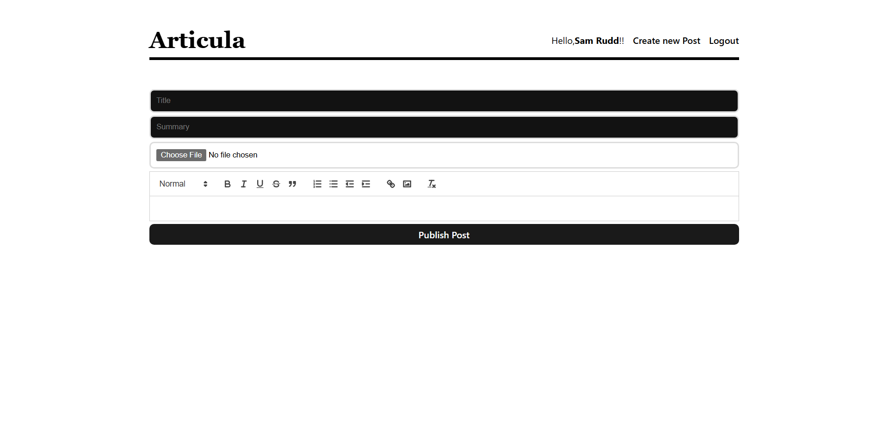

# Articula - Medium-Inspired Blogging Platform

A full-stack blogging platform inspired by Medium, built with the MERN stack and modern web development practices. This project demonstrates a complete implementation of a content management system with user authentication, rich text editing, and responsive design.


*Clean, minimalist homepage displaying recent blog posts*


*Individual post view with editing capabilities for authors*


*Rich text editor for creating and editing posts*

## 🚀 Tech Stack & Architecture

### Frontend Technologies
- **React 18.2.0** - Modern React with functional components and hooks
- **Vite 5.2.0** - Lightning-fast build tool and development server
- **React Router DOM 6.23.1** - Client-side routing with nested routes
- **React Context API** - Global state management for user authentication
- **React Quill 2.0.0** - Rich text editor with customizable toolbar
- **Date-fns 3.6.0** - Modern date manipulation and formatting
- **CSS3** - Custom styling with responsive design principles

### Backend Technologies
- **Node.js** - JavaScript runtime environment
- **Express.js 4.19.2** - Web application framework
- **MongoDB Atlas** - Cloud-hosted NoSQL database
- **Mongoose 8.4.1** - MongoDB object modeling with schema validation
- **JWT (jsonwebtoken 9.0.2)** - Stateless authentication tokens
- **bcryptjs 2.4.3** - Password hashing and salting
- **Multer 1.4.5** - Multipart/form-data handling for file uploads
- **Cookie-parser 1.4.6** - HTTP cookie parsing middleware
- **CORS 2.8.5** - Cross-Origin Resource Sharing configuration

### Development & Deployment
- **ESLint** - Code linting with React-specific rules
- **Nodemon** - Automatic server restart during development
- **Vercel** - Serverless deployment configuration
- **ES6 Modules** - Modern JavaScript module system throughout

## 🏗️ Architecture & Design Patterns

### Project Structure
```
Articula-MERN/
├── api/                    # Backend server
│   ├── server.js          # Express server configuration
│   ├── models/            # Mongoose data models
│   │   ├── UserModel.js   # User schema with pre-save hooks
│   │   └── PostModel.js   # Blog post schema with relationships
│   ├── uploads/           # File storage for images
│   └── vercel.json        # Deployment configuration
├── client/                # Frontend React application
│   ├── src/
│   │   ├── pages/         # Route components
│   │   ├── components/    # Reusable UI components
│   │   ├── UserContext.jsx # Global authentication state
│   │   └── App.jsx        # Main application component
│   └── public/            # Static assets
└── package.json           # Root dependencies
```

### Key Design Patterns Implemented

#### 1. **Component Composition Pattern**
- Modular React components with single responsibilities
- Reusable `EditTools` component for rich text editing
- Layout component pattern for consistent page structure

#### 2. **Context Provider Pattern**
- `UserContextProvider` for global authentication state
- Eliminates prop drilling for user information
- Centralized user session management

#### 3. **Higher-Order Component Pattern**
- Protected routes that check authentication status
- Conditional rendering based on user authorization

#### 4. **Repository Pattern (Backend)**
- Mongoose models as data access layer
- Clean separation between data models and business logic
- Schema-based validation and middleware hooks

## 🔐 Authentication & Security Features

### JWT-Based Authentication
- **Stateless Authentication**: JWT tokens stored in HTTP-only cookies
- **Password Security**: bcrypt hashing with salt rounds
- **Session Management**: Automatic token verification on protected routes
- **Secure Logout**: Token invalidation and cookie clearing

### Security Implementations
```javascript
// Pre-save password hashing middleware
UserSchema.pre('save', async function (next) {
  if (!this.isModified('password')) return next();
  const salt = await bcrypt.genSalt(10);
  this.password = await bcrypt.hash(this.password, salt);
  next();
});
```

### Authorization Patterns
- **Route Protection**: Server-side middleware for protected endpoints
- **Author Verification**: Users can only edit their own posts
- **Conditional UI**: Dynamic header based on authentication status

## 📝 Content Management Features

### Rich Text Editor Integration
- **React Quill Implementation**: Full-featured WYSIWYG editor
- **Custom Toolbar**: Headers, formatting, lists, links, and media
- **HTML Content Storage**: Rich formatting preserved in database
- **Safe Rendering**: `dangerouslySetInnerHTML` for content display

### File Upload System
- **Multer Middleware**: Handles multipart form data
- **File Processing**: Automatic file extension detection and renaming
- **Static File Serving**: Express middleware for image delivery
- **Image Optimization**: Supports multiple formats (PNG, JPG, JPEG, AVIF, WebP)

### CRUD Operations
- **Create Posts**: Authenticated users can publish new content
- **Read Posts**: Public access to published articles
- **Update Posts**: Authors can edit their own content
- **Delete Protection**: Authorization checks prevent unauthorized edits

## 🗄️ Database Design & Relationships

### MongoDB Schema Design
```javascript
// User Schema
const UserSchema = new Schema({
  username: { type: String, required: true, min: 4, unique: true },
  password: { type: String, required: true, min: 4 }
});

// Post Schema with Author Reference
const PostSchema = new Schema({
  title: String,
  summary: String,
  content: String,
  cover: String,
  author: { type: Schema.Types.ObjectId, ref: 'User' }
}, { timestamps: true });
```

### Data Relationships
- **One-to-Many**: Users can have multiple posts
- **Population**: Mongoose populate for author information
- **Timestamps**: Automatic createdAt and updatedAt fields
- **Reference Integrity**: ObjectId references between collections

## 🎨 Frontend Architecture & State Management

### React Patterns Used
- **Functional Components**: Modern React with hooks
- **Custom Hooks**: useEffect for data fetching
- **State Management**: useState for local component state
- **Context API**: Global user authentication state
- **Conditional Rendering**: Dynamic UI based on user status

### Routing Implementation
```javascript
// Nested routing with React Router
<Routes>
  <Route path='/' element={<Layout />}>
    <Route index element={<HomePage />} />
    <Route path='/login' element={<LoginPage />} />
    <Route path='/register' element={<RegisterPage />} />
    <Route path='/create' element={<NewPost />} />
    <Route path='/post/:id' element={<PostPage />} />
    <Route path='/edit/:id' element={<EditPost />} />
  </Route>
</Routes>
```

### Async/Await Pattern
- **Modern JavaScript**: Consistent use of async/await over promises
- **Error Handling**: Try-catch blocks for robust error management
- **User Feedback**: Alert notifications for user actions

## 🌐 API Design & RESTful Endpoints

### Authentication Endpoints
- `POST /register` - User registration with password hashing
- `POST /login` - User authentication with JWT token generation
- `GET /profile` - Token verification and user profile retrieval
- `POST /logout` - Session termination and cookie clearing

### Content Management Endpoints
- `GET /post` - Retrieve all posts with pagination and author population
- `POST /post` - Create new post with file upload
- `GET /post/:id` - Retrieve specific post by ID
- `PUT /post` - Update existing post with authorization check

### Middleware Stack
```javascript
// CORS configuration for cross-origin requests
app.use(cors({ credentials: true, origin: ['http://localhost:5173'] }));

// JSON parsing and cookie handling
app.use(express.json());
app.use(cookieParser());

// Static file serving for uploads
app.use('/uploads', express.static(path.join(__dirname, 'uploads')));
```

## 📱 User Experience & Interface Design

### Responsive Design Principles
- **Mobile-First Approach**: Responsive layout for all screen sizes
- **Clean Typography**: Readable fonts and proper spacing
- **Intuitive Navigation**: Clear header with contextual links
- **Visual Hierarchy**: Proper use of headings and content structure

### User Flow Implementation
1. **Landing Page**: Browse posts without authentication
2. **Registration/Login**: Simple form-based authentication
3. **Content Creation**: Rich text editor with image upload
4. **Post Management**: View and edit own posts
5. **Reading Experience**: Clean, distraction-free post viewing

### Interactive Features
- **Dynamic Header**: Changes based on authentication status
- **Confirmation Dialogs**: User confirmation for critical actions
- **Real-time Feedback**: Success/error messages for user actions
- **Conditional Editing**: Edit buttons only for post authors

## 🚀 Performance & Optimization

### Frontend Optimizations
- **Vite Build Tool**: Fast hot module replacement and optimized builds
- **Component Lazy Loading**: Efficient code splitting
- **State Management**: Minimal re-renders with proper dependency arrays
- **Image Optimization**: Multiple format support for better performance

### Backend Optimizations
- **Database Indexing**: Efficient queries with proper indexing
- **Pagination**: Limited results to prevent performance issues
- **File Upload Optimization**: Efficient file handling with Multer
- **Connection Pooling**: MongoDB connection optimization

## 🔧 Development Workflow & Best Practices

### Code Quality
- **ESLint Integration**: Consistent code formatting and best practices
- **Modular Architecture**: Separation of concerns across components
- **Error Boundaries**: Proper error handling throughout the application
- **TypeScript Ready**: Configuration supports TypeScript integration

### Development Environment
- **Hot Reload**: Vite development server with instant updates
- **Environment Variables**: Secure configuration management
- **CORS Configuration**: Proper cross-origin setup for development
- **Database Connection**: Robust MongoDB connection with error handling

## 📦 Deployment & Production

### Vercel Configuration
```json
{
  "version": 2,
  "builds": [
    {
      "src": "server.js",
      "use": "@vercel/node"
    }
  ],
  "routes": [
    {
      "src": "/(.*)",
      "dest": "server.js"
    }
  ]
}
```

### Production Considerations
- **Environment Variables**: Secure API keys and database URLs
- **Static File Serving**: Optimized asset delivery
- **Error Logging**: Comprehensive error tracking
- **Security Headers**: CORS and security middleware configuration

## 🛠️ Setup & Installation

### Prerequisites
- Node.js (v16 or higher)
- MongoDB Atlas account
- Git for version control

### Installation Steps

1. **Clone the repository:**
   ```bash
   git clone https://github.com/San4568GH/Articula.git
   cd Articula-MERN
   ```

2. **Install root dependencies:**
   ```bash
   npm install
   ```

3. **Setup backend server:**
   ```bash
   cd api
   npm install
   nodemon server.js
   ```

4. **Setup frontend application:**
   ```bash
   cd ../client
   npm install
   npm run dev
   ```

5. **Access the application:**
   - Frontend: http://localhost:5173
   - Backend API: http://localhost:4000

### Environment Configuration
Create appropriate environment variables for:
- MongoDB connection string
- JWT secret key
- CORS origins
- File upload directories

## 🎯 Key Learning Outcomes

This project demonstrates proficiency in:

1. **Full-Stack Development**: Complete MERN stack implementation
2. **Modern React Patterns**: Hooks, Context API, and functional components
3. **Authentication Systems**: JWT-based secure authentication
4. **Database Design**: MongoDB schema design and relationships
5. **File Upload Handling**: Multipart form data and static file serving
6. **RESTful API Design**: Clean, semantic API endpoints
7. **State Management**: Global and local state handling
8. **Responsive Design**: Mobile-first, accessible user interfaces
9. **Security Best Practices**: Password hashing, CORS, and authorization
10. **Modern Development Tools**: Vite, ESLint, and deployment configuration

## 🔮 Future Enhancements

Potential improvements and features:
- **Comment System**: Reader engagement with post comments
- **Social Features**: User profiles and follow functionality
- **Search & Filtering**: Content discovery improvements
- **Email Notifications**: User engagement features
- **Admin Dashboard**: Content moderation capabilities
- **SEO Optimization**: Meta tags and social sharing
- **Progressive Web App**: Offline functionality and mobile installation
- **Real-time Features**: Live editing and collaboration
- **Analytics Dashboard**: Content performance metrics
- **Content Categories**: Tagging and categorization system

---

**Articula** represents a comprehensive understanding of modern web development practices, showcasing the ability to build scalable, secure, and user-friendly web applications using industry-standard technologies and design patterns.
